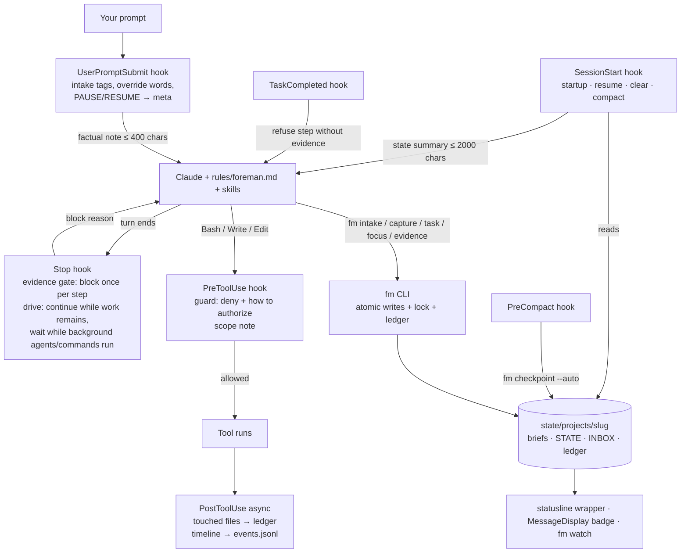

# Foreman — system map

Not loaded every session (`~/.claude/rules/foreman.md` points here). Read it when you're unsure where something lives or how the parts interact. `fm doctor` checks the file map below against disk.

## 1. What Foreman is

Foreman is a local Claude Code plugin (hooks, a small state CLI `fm`, skills, always-on rules, two read-only agents) that runs every request, however terse, through one loop:

**capture → expand → ground → plan → execute → verify → reflect → record**

It keeps one central, current record per project (what's active, what's queued, what was decided, what was learned), refuses "done" without recorded evidence, captures new ideas instead of chasing them, resumes at the exact step after `/compact`, `/clear` or a new session, blocks dangerous commands in bypass mode, audits finished work through independent lenses before it counts as done, asks for consent in plain chat (never by making you run a command), brainstorms open-ended requests, and keeps working through the queue ("drive", optionally in full autonomy) until it's empty or it needs you. It's cheap: ~62 always-on instruction lines and ~1.3k tokens of skill/agent descriptions; hooks run at p95 ≤ 38 ms.

## 2. How to prompt it

A plain one-line request gets the full treatment: Claude classifies it ("Treating this as FIX, tier S."), writes a brief, plans to the tier, executes, verifies with evidence and records.

```
fix the login timeout on slow wifi                       ← one-liner: classified and planned
FIX: login times out after 30s on slow networks          ← tagged
FEATURE: export report as CSV @src/reports #T-0012       ← @scope, depends on T-0012
CLEAN!: collapse the three date helpers into one         ← ! urgent (preempts)
PERF?: dashboard first paint takes 4s                    ← ? explore: options + recommendation, no code yet
SECURITY: review the upload endpoint
CONTEXT: Django app; don't touch migrations              ← applies to every item in the block
NEVER: push to main                                      ← CONSTRAINT / MUST / NEVER
DONE-WHEN: all tests pass and the CSV opens in Excel     ← block acceptance
SKIP: mobile layout                                      ← non-goal
```
Tags: CLEAN (REFACTOR, TIDY) · PERFORMANCE (PERF) · SECURITY (SEC) · FIX (BUG) · FEATURE (FEAT, CAPABILITY, CAP, ADD) · RESEARCH (SPIKE, INVESTIGATE) · CONTEXT (NOTE) · CONSTRAINT (MUST, NEVER) · DONE-WHEN (ACCEPT) · SKIP (OUT).

Order: BASELINE → RESEARCH → CLEAN → PERFORMANCE → SECURITY → FIX → FEATURE → FINAL VERIFY → REFLECT. Dependencies override it; a baseline-breaking FIX and critical security findings are hoisted.

Override words: `NOW:` (checkpoint, switch, offer to resume) · `PAUSE` / stop / hold on (checkpoint; drive pauses) · `RESUME` · `STATUS` · `FULL AUTO` / `STANDARD AUTONOMY` (whole message) · "that's for the current task" (your last message was a steer, not new work). Anything new while a task is active is captured, not started.

Plain words work too: Claude runs every command itself ("is foreman ok?" → doctor, "clean up" → tidy, "this repo is sensitive" → `fm sensitive on`). Open-ended requests ("super improve it") go to `/foreman:brainstorm`. When Claude needs your consent for a guard category it runs `fm ask`, and Claude Code shows you its own permission prompt saying exactly what would be granted; approving grants it (only an approved prompt for that very call can), refusing refuses it, and nothing you type in chat cancels it. Other questions come as an AskUserQuestion prompt. In full autonomy nothing is asked mid-run; what only you can grant is asked at the end.

Slash commands (Claude can start all but capture itself): `/foreman:intake` · `/foreman:brainstorm` · `/foreman:next` · `/foreman:resume` · `/foreman:status` · `/foreman:capture <text>` · `/foreman:tidy` · `/foreman:doctor` · `/foreman:reflect` · `/foreman:improve` · `/foreman:playbooks` · `/foreman:build`.

CLI (on the Bash tool PATH): `fm init|state|queue|next|resume|watch|intake|capture|task new|show|set|step|ac|evidence [--run CMD]|audit|log|done|block|drop|defer|focus|checkpoint|log|ask|decide|research add|sensitive on|off|drive on|off|autonomy [standard|full]|ideas|serve [start|status|stop] [PATH]|run|check [add|rm|list] [--evidence ID]|audit prep ID|plugins find|check|install|enable|disable|add-marketplace|forget|docs [--strict]|tidy|doctor [--full|--restore-state]|install-user|uninstall-user` — see `fm --help`.

The procedure is enforced by the harness, not recalled: each task's stage (captured → planning → ready → executing → verifying → auditing → closing) is derived from its brief; `fm next` and every prompt, session start and Stop note name the one next required action and its procedure; `fm focus` refuses a brief that isn't planned for its tier; file edits inside a Foreman project are refused while no task is active (`fm task new … --ac … --step … --focus` starts a small one in one command).

## 3. File map

| Path | Purpose | Owner | Loaded | Budget |
|---|---|---|---|---|
| `BUILD_PROMPT.md` | origin spec | user | on demand | — |
| `MASTER.md` | this map | Claude (via tasks) | on demand | — |
| `README.md` | repo overview, install | Claude | on demand | — |
| `CHANGELOG.md` | per-version changes | Claude | on demand | — |
| `install.sh` | one-line bootstrap: clone, plugins, marketplace + plugin, bypass, wiring | user/Claude | run by user | — |
| `setup-plugins.sh` | curated plugin setup, `--dry-run` | user/Claude | run by user | — |
| `configure-repo.sh` | point install at a GitHub repo (one-time) | user | run by user | — |
| `reset-claude.sh` | optional behavior-layer reset before installing | user | run by user | — |
| `.claude-plugin/marketplace.json` | local marketplace `foreman` → `./plugin` | Claude | by Claude Code | — |
| `plugin/.claude-plugin/plugin.json` | plugin manifest (name, version) | Claude | by Claude Code | — |
| `plugin/settings.json` | plugin default `subagentStatusLine` | Claude | by Claude Code | only `agent`/`subagentStatusLine` honored |
| `plugin/bin/fm` | CLI entry (on the Bash tool PATH; protected) | Claude | on call | — |
| `plugin/lib/` | `fmcore` (state, briefs, queue, intake, ledger, locks, audits), `fmcli`, `fmguard`, `fmhooks` (incl. chat approvals), `fmtidy`, `fmdoctor`, `fmwatch`, `fmsetup`, `fmideas` (tool-less brainstorm children), `fmserve` (`fm serve` / `fm run`), `fmplugins` (`fm plugins`: marketplace search, conflict check) — all protected core | Claude | on call | stdlib only |
| `plugin/hooks/hooks.json` | one handler per event (13 events), exec form (protected) | Claude | by Claude Code | p95 ≤ 150 ms |
| `plugin/hooks/hook` | dispatcher `hook <Event>`; guard fails closed (protected) | Claude | per event | — |
| `plugin/hooks/statusline` | statusLine wrapper: original + claude-hud + Foreman line; session snapshots (protected) | Claude | per statusline refresh | < 100 ms own work |
| `plugin/hooks/subagent-statusline` | per-subagent rows (task, tokens vs window, elapsed) (protected) | Claude | per refresh | — |
| `plugin/rules/foreman.md` | always-on operating rules (protected; symlinked into `~/.claude/rules/`) | Claude | every session | ≤ 80 lines (58) |
| `plugin/output-styles/foreman.md` | the Foreman reply format (task/stage header, `✓ cmd → result` lines, `Changed:`, `Next:`, `⚠ Needs you:`); `fm install-user` selects `foreman:Foreman` when you have no style | Claude Code | system prompt, every turn | < 260 words |
| `plugin/skills/` | intake (+ references: planning, execute, audit lenses, delegate, ported superpowers procedures), brainstorm (+ `references/ideas-prompt.md` for `fm ideas`), next, resume, status, capture, tidy, doctor, reflect, improve, playbooks (40 ported ECC references) | Claude | descriptions always-on; bodies on invoke | SKILL.md < 500 lines |
| `plugin/agents/` | `fm-recon`, `fm-reviewer` (read-only tool allowlists; the reviewer runs one audit lens per brief). No tool-less agent: Claude Code gives an empty `tools:` list every tool | Claude | on delegation | output ≤ 400 words |
| `plugin/commands/build.md` | `/foreman:build` (the bootstrap) | Claude | on invoke | — |
| `plugin/templates/` | `brief.md` template | Claude | by fm | — |
| `plugin/themes/` | optional Foreman color theme (`/theme`) | Claude | on selection | — |
| `plugin/observability/` | telegraf OTel input, Grafana dashboard, setup notes | Claude | manual | — |
| `plugin/evals/` | `claude plugin eval` cases with the rules embedded (protected) | Claude | `claude plugin eval` | `--max-cost-usd` |
| `plugin/tests/` | unit/behaviour tests, fixtures, hook bench, `e2e/` (live scenarios, install round trip, eval sync) | Claude | on demand | — |
| `plugin/uninstall.sh` | remove wiring, plugin and marketplace; keeps state unless `--purge-state` | Claude | run by user | — |
| `plugin/README.md` | plugin overview | Claude | on demand | — |
| `plugin/THIRD_PARTY_LICENSES.md` | MIT licenses of ported ECC and superpowers material | Claude | on demand | — |
| `local/recon.md` | Phase 0 recon (machine-specific, runtime, gitignored) | Claude | on demand | — |
| `local/PLAN.md` | build plan, deltas, decisions (runtime, gitignored) | Claude | on demand | — |
| `local/verification.md` | Phase 7 results (runtime, gitignored) | Claude | on demand | — |
| `backups/` | `~/.claude` tarballs and settings.json backups (runtime, gitignored) | fm/install.sh | restore only | — |
| `state/registry.md` | project index, generated from meta.json (runtime) | fm | on demand | — |
| `state/install-manifest.json` | every change outside the repo, with originals (runtime) | fm | by uninstall | — |
| `state/events.jsonl` | hook/tool timeline for `fm watch` (runtime; rotated by tidy) | hooks | by fm watch | rotate > 5 MB |
| `state/sessions/<id>.json` | statusline snapshots (runtime; cleaned after 7 days) | statusline | by fm watch | — |
| `state/logs/hooks.log` | hook errors (runtime; rotated by tidy) | hooks | by fm doctor | rotate > 1 MB |
| `state/projects/<slug>/meta.json` | project metadata: path, sensitive, drive, paused, autonomy, pending approvals, session, last tidy (runtime) | fm, UserPromptSubmit | by hooks | — |
| `state/projects/<slug>/STATE.md` | focus + queue + inbox, generated from briefs (runtime) | fm | summary injected at SessionStart | ≤ 60 lines |
| `state/projects/<slug>/INBOX.md` | captured items, generated (runtime) | fm | count + titles injected | — |
| `state/projects/<slug>/tasks/T-NNNN-*.md` | briefs: spec, steps, evidence, log (runtime) | fm | on demand | S ≤ 10 content lines |
| `state/projects/<slug>/decisions.md` | decisions: date, what, why, rejected (runtime) | fm (`fm decide`) | on demand | — |
| `state/projects/<slug>/research/` | saved recon/research summaries (runtime) | fm (`fm research add`) | on demand | — |
| `state/projects/<slug>/ledger.jsonl` | append-only event log (runtime; rolled monthly by tidy) | fm, hooks | never wholesale | roll > 1 MB |
| `state/projects/<slug>/archive/` | archived briefs, ledgers, memory copies (runtime) | fm tidy | on demand | — |
| `state/projects/<slug>/gate.json` | Stop-gate/drive bookkeeping; with `state.line`, `badge.txt` caches (runtime) | hooks, fm | per hook | — |
| `~/.claude/rules/foreman.md` | symlink to `plugin/rules/foreman.md` (runtime, created by `fm install-user`) | fm | every session | — |
| `~/.claude/CLAUDE.md` | your preferences + a 4-line Foreman block between markers (runtime) | you (+ fm block) | every session | ≤ 50 lines |
| `~/.claude/settings.json` | statusLine wrapper, deny rules, drive env, bypass default (runtime; originals in the manifest) | you / fm install-user | every session | — |
| `~/.claude/projects/<encoded path>/memory/` | native auto memory: durable learnings (runtime) | Claude | MEMORY.md at startup (200 lines / 25 KB) | tidy checks it |

## 4. Interaction diagram



## 5. Lifecycle walkthrough (a `FIX:` line to an archived task)

1. You type `FIX: login times out on slow wifi`. **UserPromptSubmit** (`plugin/hooks/hook` → `fmhooks.user_prompt_submit`) injects "Message has 1 intake item (FIX). No active task." and updates `meta.json` (session heartbeat).
2. Claude follows `rules/foreman.md` → `/foreman:intake`: `fm intake` creates `tasks/T-0012-login-times-out-on-slow-wifi.md` (status captured) from `templates/brief.md`, appends `intake` to `ledger.jsonl`, and regenerates `STATE.md`, `INBOX.md`, `state.line`, `badge.txt`.
3. R1–R4: `fm task new … --from T-0012` (planned), `fm task set --section …`, `fm task ac add`, `fm task step add`; grounding reads the code; a tier-M plan compares two approaches. Adjacent ideas go to `fm capture --source followup` (new briefs).
4. `fm log baseline …`, then `fm focus T-0012` (status active). **PreToolUse** runs the guard on every Bash/Write/Edit (`lib/fmguard.py`) and notes out-of-scope edits; **PostToolUse** records `touched` files and the timeline (`state/events.jsonl`). The reply badge `[T-0012 FIX · 2/4 · 14:02]` comes from **MessageDisplay** (screen only).
5. Each step: `fm task step T-0012 done N --evidence "<cmd>" "<result>"` (refused without evidence). Steers go in with `fm task log`. If Claude claims "done" without evidence, the **Stop** hook blocks once (`gate.json`); if work remains, **drive** continues it.
6. `/compact` mid-task: **PreCompact** writes the auto resume block into the brief; **SessionStart(compact)** re-injects the focus and resume notes.
7. Audits (`references/audit.md`): tier M → `intent` plus the riskiest other lens, each a `foreman:fm-reviewer` run with its own context slice; findings are reproduced, fixed test-first or captured, then `fm task audit T-0012 <lens> …`. `fm task ac T-0012 check N --evidence …`, `fm task done T-0012` (refused unless every step and criterion has evidence and the tier's audits postdate the last edit). `/foreman:reflect`: `fm decide …` → `decisions.md`; learnings → auto memory; Foreman ideas → `fm capture --self`.
8. 14 days later `fm tidy --apply` moves the brief to `archive/YYYY-MM/`, rolls old ledger months into `archive/ledger-YYYY-MM.jsonl`, and records `last_tidy`.

## 6. Source of truth and precedence

| Information | Lives in | Loaded into context |
|---|---|---|
| Foreman operating rules | `~/.claude/rules/foreman.md` (symlink) | every session |
| Your stable preferences | `~/.claude/CLAUDE.md` | every session |
| Project conventions and commands | project `CLAUDE.md` | every session in that project |
| Path/topic-specific rules | `.claude/rules/*.md` with `paths:` | when matching files are read |
| Procedures | skills (`plugin/skills/`) | on demand |
| Current focus and next step | `STATE.md` (generated from briefs) | injected at startup/resume/clear/compact |
| Task specs, progress, evidence | `tasks/T-*.md` | on demand |
| Unplanned requests | briefs with status `captured` (`INBOX.md` is a view) | count + titles injected |
| Why things were decided | `decisions.md` | on demand |
| Durable learnings and gotchas | native auto memory (`MEMORY.md` + topic files) | startup window, then on demand |
| History | `ledger.jsonl` | never wholesale; via `fm` |
| Pending consent | `meta.json` `pending_approvals` (written by `fm ask`, decided only by your next prompt) | reported by the prompt hook |
| In-session checklist | the brief's Steps (built-in task tools are off on current models; the TaskCompleted gate is ready if enabled) | via `fm resume` |
| Knowledge graph | none installed | — |

Precedence: your current message > project CLAUDE.md and rules > `rules/foreman.md` > skill defaults. Safety guards are never overridden.

## 7. Integrations

| Plugin / tool | Stage | How |
|---|---|---|
| context7 (MCP) | GROUND | library/API docs during R2 |
| clangd-lsp, rust-analyzer-lsp | GROUND, VERIFY | diagnostics |
| ponytail | CLEAN, all | minimal-code discipline; `/ponytail:ponytail-audit`, `-debt`, `-review` for CLEAN (injects ~5.7k chars at SessionStart and into every subagent) |
| security-guidance | SECURITY | continuous edit warnings + async Stop/commit reviews (non-blocking; coexists with the Stop gate) |
| code-review | FINAL VERIFY (L) | `/code-review`; `foreman:fm-reviewer` for an independent read-only review |
| skill-creator, `claude plugin eval` | REFLECT / improve | author and evaluate skills; eval referee |
| claude-md-management | REFLECT | content revision on demand; mechanical CLAUDE.md lint is owned by `fm tidy` |
| frontend-design | FEATURE (UI) | on demand |
| claude-hud | visibility | rendered inside the Foreman statusline wrapper |
| plugin-dev | build only | disabled after the build |
| ECC | disabled | ~41k always-on tokens, sync hooks on every tool call, competing memory/planning, transcript sent to a model at compaction; useful procedures ported to `/foreman:playbooks` |
| superpowers | disabled | competing orchestrator; debugging, TDD and verification ported into intake references |
| pyright-lsp, typescript-lsp | disabled | language servers not installed (re-enable after installing them) |
| playwright, chrome-devtools-mcp | disabled at user scope | enable per web repo: `claude plugin enable <id> --scope local` |
| design, figma (synced) | turned off locally | not doing design work |
| Grafana/InfluxDB/telegraf | history | `plugin/observability/`; enable once the collector endpoint is known |

Re-enable anything with `claude plugin enable <id>`; `plugin/uninstall.sh` lists what Foreman disabled.

## 8. Relationship to BUILD_PROMPT.md and the repo

`BUILD_PROMPT.md` is the origin spec; this repo is how Foreman travels between machines (`install.sh` one-liner). Changes to Foreman itself go through intake as tasks against `~/.claude/foreman/plugin` (Foreman's own project), and MASTER.md is updated in the same commit; `fm doctor` fails if the file map drifts from disk. Self-improvements are bounded and eval-gated (`/foreman:improve`): built in an `improve/<date>` worktree, compared with `claude plugin eval`, and merged only with your approval. The guard blocks agent writes to protected core (all Foreman code in `plugin/lib`, `bin` and `hooks`, the rules, evals, BUILD_PROMPT.md, settings), including writes from interpreter code, and agents can't grant themselves `core`: Claude runs `fm ask <ID> core` and your yes grants it. The same holds for `remote` (starting `fm serve`) and `plugin` (`claude plugin install|enable|disable|uninstall|update`, `claude plugin marketplace add|remove|update`, `claude mcp add|remove`, `claude config set`, `fm plugins install|enable|disable|add-marketplace`, writes under `~/.claude/plugins` (installed plugins' code and registries, including `git pull`/`checkout` there), and `claude --settings|--mcp-config|--plugin-dir` sessions), and `~/.claude.json` (workspace trust, MCP servers) counts as core; user systemd unit files count as `system`.

## 9. Operations

- Dev loop: edit `plugin/` → `/reload-plugins` (the local marketplace loads in place). Tests: `python3 -m unittest discover -s plugin/tests -t plugin/tests`. Hook latency: `python3 plugin/tests/bench_hooks.py`. Validation: `claude plugin validate --strict plugin`. Live scenarios: `python3 plugin/tests/e2e/scenarios.py`; install round trip: `python3 plugin/tests/e2e/roundtrip.py`; evals: see `plugin/evals/README.md`.
- Health: `fm doctor` (`--full` also runs `install.sh --no-plugins`), `fm tidy` then `fm tidy --apply`, `fm watch` (curses; `--once` for text) in a tmux split.
- State location: `state/`, unless `~/.claude` is read-only (Bash sandbox, `claude plugin eval`, a container): then state moves once to `$XDG_STATE_HOME/foreman` (or `/tmp/foreman-state-<uid>`, cleared at reboot) and a marker there keeps every process following it. `fm doctor` warns while it's in use; `fm doctor --restore-state` moves it back once `state/` is writable. The guard treats every fallback location as state, and a marker in a directory other users can write is ignored.
- Approvals: `fm ask` raises a permission prompt (PreToolUse `ask`); the `PermissionRequest` hook notes that the dialog was really shown, and PostToolUse of that same tool call grants. A refused prompt is forgotten at your next message. The dialog text has control and bidi characters removed; unknown options or categories are refused; under `fm run` (`claude -p`, nobody to answer) fm ask is refused and the task gets blocked instead. Where a dialog can't be tied to the call, fm ask falls back to a pending request answered by your next reply ("yes…" grants, anything else cancels). A question left in a reply's text is sent back once by the Stop hook to be asked as an AskUserQuestion prompt (or decided and recorded).
- Evidence and gates: `fm task evidence ID --step N --run "<cmd>"` runs the command (bash, repo root) and records `exit N · <last two output lines>`, marked ✗ when it failed; a step or criterion whose newest evidence is a failed run can't be marked done. Evidence lines carry the worktree id they were recorded at, so `fm next` and the statusline agree with the done gate after evidence-only updates. `fm check` runs the project's gate commands (kept in the project's meta; `fm check add|rm|list`) and exits 1 on any failure; the guard checks `--run` and `fm check add` commands like typed ones. `fm audit prep ID` writes the diff since the commit the task was focused at (untracked files included) to the project's `audits/ID.diff` and prints one fm-reviewer brief per lens from `references/audit.md`.
- Plugins: `fm plugins find <need>` searches the local marketplace indexes (installed/enabled state, always-on estimate); `fm plugins check [ID]` flags enabled plugins with a synchronous Stop hook (competes with Foreman's gate and drive), duplicate MCP servers, or process skills that duplicate Foreman (`fm doctor` warns); `fm plugins install ID` (after your yes to `fm ask ID plugin`; one yes covers one change, and a command bundling several is refused) installs or re-enables it, and a fresh install is recorded so `fm uninstall-user` removes it (only once it really landed in `installed_plugins.json`). Nothing found → `fm plugins add-marketplace <owner/repo | git URL | path>` (same yes), recorded and removed the same way; `fm plugins forget ID` keeps something through uninstall. `check` also reports the curated conflicts (`KNOWN_CONFLICTS`, the same list `setup-plugins.sh` warns about) and resolves enabled plugins with this project's `.claude/settings*.json`.
- Headless (a server, no terminal open): `fm serve` in a repo runs Claude Code Remote Control there as a systemd user unit (`~/.config/systemd/user/foreman-serve-<slug>.service`; its output, which includes the session URL, is discarded and errors go to the journal), survives logout and reboot (it enables linger, or warns), restarts on failure with a 5-in-10-minutes breaker (a restart reconnects its sessions), and puts the project in full autonomy with drive on; send requests from claude.ai/code or the Claude app. Starting it needs your yes (`fm ask ID remote`); `claude` is found on the saved PATH at every start. It uses your default permission mode unless `--permission-mode` is given (sensitive repos: `default`, approve from the phone). `fm serve status` (unit state, repo, active task; the last journal lines, URLs hidden, when it's down; `fm doctor` warns on a dead unit) · `fm serve stop [--all]` (restores autonomy and drive; uninstall stops every unit). Claude Code must trust the repo root itself first (open `claude` there once; a trusted parent folder doesn't count). `fm run` instead works the queue in fresh `claude -p` sessions, one task each (drive scoped by `FOREMAN_DRIVE_TASK`), skipping tasks that wait on you; it stops on no progress, a nonzero exit (usage limit, login) or the per-session timeout, logs to `state/logs/run-<slug>.log` (redacted), and refuses while `fm serve` runs in the same project.
- Disable: `claude plugin disable foreman@foreman` (Claude Code works normally). Drive only: `fm drive off`. Per-repo manual permissions: `fm sensitive on`.
- Uninstall: `plugin/uninstall.sh [--dry-run] [--purge-state] [--yes]` removes plugin and marketplace, undoes the wiring from the manifest (including the plugin maps that leaves empty), and archives state before removing it.
- Restore the pre-build backup: `tar -C ~ -xzf ~/.claude/foreman/backups/claude-20260925-233203.tgz` (overwrites same-named files, deletes nothing).
- Logs: `state/logs/hooks.log` (hook errors), `state/events.jsonl` (timeline), per-project `ledger.jsonl`. Debug hooks with `claude --debug`.
- Another machine: `gh repo clone ChaseSunstrom/foreman ~/.claude/foreman && ~/.claude/foreman/install.sh`, or `git pull` in `~/.claude/foreman`.
- Rendering tips: `/tui fullscreen` (mouse, click-to-expand tool output, live `/diff` panel), `/focus`, `Ctrl+O` transcript search. Many sessions: `claude agents`. Visual diffs: the Desktop app's Code tab.

## 10. Known limitations

- The guard is a speed bump, not a sandbox: shell text can be obfuscated (a script file that writes elsewhere, computed paths). Interpreter code that names a protected path and writes is caught, and archives, clones and copies are checked by where they write (not by archive members). Running `claude plugin|mcp|config` changes (directly, with global options first, from interpreter code, or as a `/plugin install`-style prompt in argv, stdin or a heredoc) needs `plugin`, but an obfuscated spelling isn't recognized; persistence outside systemd (crontab, shell rc files) isn't gated; deny rules and git are the other layers.
- Hints vs gates: the next action injected each turn is a hint the model can ignore; the gates are enforced by code (no edits without an active task, `fm focus` plan gate, `fm task done` blockers). Doc drift blocks done only in docs a task says it updated; elsewhere `fm docs` and done report it.
- `fm run` doesn't wait out usage limits: it stops and says so (exit 1 for every stop reason; the message and log say which). Remote Control's own stderr lands in the journal unredacted. Remote Control output (it includes the session URL) is discarded, never logged.
- The state fallback is found through each process's `XDG_STATE_HOME` and temp dir; processes that disagree on those would split state.
- The prompt path trusts Claude Code's dialog: a mode or another hook that auto-approves permission dialogs would also approve an `fm ask`. The chat fallback trusts that a reply starting with yes answers the question just asked; pasted text never counts, and requests expire after 24 h or at your next reply.
- Subagents can't be tool-less (an empty `tools:` list means every tool), so brainstormers run as `claude -p` children via `fm ideas` (no tools, no MCP, no user plugins).
- Built-in task tools are off on current models, so the TaskCompleted gate is dormant unless `CLAUDE_CODE_ENABLE_TODO_TOOLS=1`.
- `footerLinksRegexes` isn't used (only http(s)/editor URLs are allowed; T-ids can't reach brief files).
- Evals run in a temp HOME, so each case embeds the rules (`tests/e2e/sync_evals.py`). Score at 1.1.0: 1.0 (5/5 cases, one run each; single runs are noisy, so compare candidates over several).
- Konsole may ignore OSC 777 notifications and OSC 9;4 progress; titles work.
- Telemetry needs the collector endpoint before it can be enabled.
- A per-repo opt-out must use `defaultMode: "default"` (Claude Code ignores `auto` and `bypassPermissions` in project/local settings).

## 11. Deviations from BUILD_PROMPT.md

Python stdlib `fm` (jq absent) · captures are briefs with status `captured`; INBOX.md, STATE.md and registry.md are generated views · `fm intake`, `fm task log`, `fm decide`, `fm research add`, `fm sensitive`, `fm drive`, `fm install-user/uninstall-user` added · per-repo opt-out uses `default` · task-tool mirroring dormant · statusLine wraps your original line plus claude-hud · footerLinksRegexes skipped · RESEARCH ordered right after BASELINE · one Stop handler (evidence gate + drive + terminal sequences) · drive mode (your request) with `CLAUDE_CODE_STOP_HOOK_BLOCK_CAP=60` · ECC procedures ported (your request) into one on-demand playbooks skill · eval cases embed the rules · guard category `self-authorize` (found by live verification) · 1.1: chat approvals (`fm ask`), tiered audits gating done, full autonomy, brainstorm with tool-less children, all Foreman code protected. Details and reasons: `local/PLAN.md` §1 (D1–D22).
