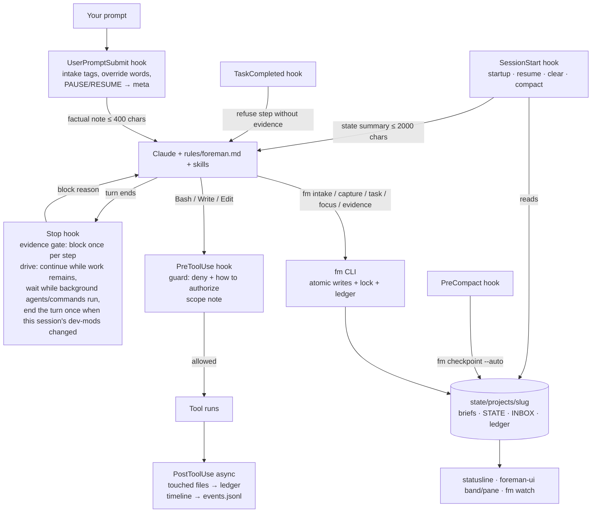

# Foreman — system map

Not loaded every session (`~/.claude/rules/foreman.md` points here). Read it when you're unsure where something lives or how the parts interact. `fm doctor` checks the file map below against disk.

## 1. What Foreman is

Foreman is a local Claude Code plugin (hooks, a small state CLI `fm`, skills, always-on rules, two read-only agents) that runs every request, however terse, through one loop:

**capture → expand → ground → plan → execute → verify → reflect → record**

It keeps one central, current record per project (what's active, what's queued, what was decided, what was learned), refuses "done" without recorded evidence, captures new ideas instead of chasing them, resumes at the exact step after `/compact`, `/clear` or a new session, blocks dangerous commands in bypass mode, audits finished work through independent lenses before it counts as done, asks for consent in plain chat (never by making you run a command), brainstorms open-ended requests, and keeps working through the queue ("drive", optionally in full autonomy) until it's empty or it needs you. It's cheap: ~62 always-on instruction lines and ~1.3k tokens of skill/agent descriptions; hooks run at p50 ≈ 29 ms, p95 ≤ 33 ms (no `traceback` or `dataclasses` on the hook path: `fmcore.record` stands in for `@dataclass`, tracebacks load only on errors; `tests/test_core.py` keeps it that way).

## 2. How to prompt it

A plain one-line request gets the full treatment: Claude classifies it ("Treating this as FIX, tier S."), writes a brief, plans to the tier, executes, verifies with evidence and records.

```
fix the login timeout on slow wifi                       ← one-liner: classified and planned
FIX: login times out after 30s on slow networks          ← tagged
FEATURE: export report as CSV @src/reports #T-0012       ← @scope, depends on T-0012
CLEAN!: collapse the three date helpers into one         ← ! urgent (preempts)
PERF?: dashboard first paint takes 4s                    ← ? explore: options + recommendation, no code yet
SECURITY: review the upload endpoint
CONTEXT: Django app; don't touch migrations              ← applies to every item in the block
NEVER: push to main                                      ← CONSTRAINT / MUST / NEVER
DONE-WHEN: all tests pass and the CSV opens in Excel     ← block acceptance
SKIP: mobile layout                                      ← non-goal
```
Tags: CLEAN (REFACTOR, TIDY) · PERFORMANCE (PERF) · SECURITY (SEC) · FIX (BUG) · FEATURE (FEAT, CAPABILITY, CAP, ADD) · RESEARCH (SPIKE, INVESTIGATE) · CONTEXT (NOTE) · CONSTRAINT (MUST, NEVER) · DONE-WHEN (ACCEPT) · SKIP (OUT).

Order: BASELINE → RESEARCH → CLEAN → PERFORMANCE → SECURITY → FIX → FEATURE → FINAL VERIFY → REFLECT. Dependencies override it; a baseline-breaking FIX and critical security findings are hoisted.

Override words: `NOW:` (checkpoint, switch, offer to resume) · `PAUSE` / stop / hold on (checkpoint; drive pauses) · `RESUME` · `STATUS` · `FULL AUTO` / `STANDARD AUTONOMY` (whole message) · "that's for the current task" (your last message was a steer, not new work). Anything new while a task is active is captured, not started.

Plain words work too: Claude runs every command itself ("is foreman ok?" → doctor, "clean up" → tidy, "this repo is sensitive" → `fm sensitive on`). Open-ended requests ("super improve it") go to `/foreman:brainstorm`. When Claude needs your consent for a guard category it runs `fm ask`, and Claude Code shows you its own permission prompt saying exactly what would be granted; approving grants it (only an approved prompt for that very call can), refusing refuses it, and nothing you type in chat cancels it. For ongoing work on Foreman itself, `fm ask ID core --standing` asks once for a standing yes that covers Foreman's own code, rules and evals for every later task (settings, state and the guard file still ask; like trust, it covers a finding that names one file by its real path, a relative shell write included, never a tree write or a target not known before it runs: T-0180); `fm standing` shows it and `fm standing off` revokes it. `/fm-trust on`, typed by you (the mod checks the prompt came from you), also lets Claude edit the guard and Claude Code settings until `/fm-trust off` or `fm trust off`; `fm trust` shows it, and Claude can never turn it on. Other questions come as an AskUserQuestion prompt. In full autonomy nothing is asked mid-run; what only you can grant is asked at the end.

Slash commands (Claude can start all but capture itself): `/foreman:intake` · `/foreman:brainstorm` · `/foreman:next` · `/foreman:resume` · `/foreman:status` · `/foreman:capture <text>` · `/foreman:tidy` · `/foreman:doctor` · `/foreman:reflect` · `/foreman:improve` · `/foreman:playbooks` · `/foreman:build`.

CLI (on the Bash tool PATH): `fm init|state|queue|next|resume|watch|ui [--json]|intake|capture|task new [--interpretation --approach]|show|set|step|ac|evidence [--run CMD]|finish|prove|audit|log|done|block|drop [--done-in ID]|defer|focus|checkpoint|sentinel|log|ask|decide [--kind costly,outward --reverses T --review]|research add [--from-agent FILE]|ideas [--rounds N --dry K --deepen K]|recall [--corrections] [TEXT|--task ID]|map [--rebuild]|impact PATH|outline PATH|why FILE[:LINE]|pr ID|gates [TYPE TIER]|quiet -- CMD|cost [--days N]|usage|digest|share on/off|evals add ID|notify CMD|sensitive on|off|drive on|off|autonomy [standard|full]|ideas|serve [start|status|stop] [PATH]|run [--models S=…,L=…]|check [add|rm|list] [--evidence ID]|audit prep ID [--note TEXT]|audit scan [--base REV]|repeats [dismiss KEY]|sync [on|off|status|import|export]|plugins find|check|install|enable|disable|add-marketplace|forget|docs [--strict]|tidy|doctor [--full|--restore-state]|install-user|uninstall-user` — see `fm --help`.

The procedure is enforced by the harness, not recalled: each task's stage (captured → planning → ready → executing → verifying → auditing → closing) is derived from its brief; `fm next` and every prompt, session start and Stop note name the one next required action and its procedure; `fm focus` refuses a brief that isn't planned for its tier; file edits inside a Foreman project are refused while no task is active (`fm task new … --ac … --step … --focus` starts a small one in one command).

## 3. File map

| Path | Purpose | Owner | Loaded | Budget |
|---|---|---|---|---|
| `BUILD_PROMPT.md` | origin spec | user | on demand | — |
| `MASTER.md` | this map | Claude (via tasks) | on demand | — |
| `README.md` | repo overview, install | Claude | on demand | — |
| `CHANGELOG.md` | per-version changes | Claude | on demand | — |
| `install.sh` | one-line bootstrap: clone, plugins, marketplace + plugin, bypass, wiring | user/Claude | run by user | — |
| `setup-plugins.sh` | curated plugin setup, `--dry-run` | user/Claude | run by user | — |
| `configure-repo.sh` | point install at a GitHub repo (one-time) | user | run by user | — |
| `reset-claude.sh` | optional behavior-layer reset before installing | user | run by user | — |
| `.claude-plugin/marketplace.json` | local marketplace `foreman` → `./plugin` | Claude | by Claude Code | — |
| `plugin/.claude-plugin/plugin.json` | plugin manifest (name, version) | Claude | by Claude Code | — |
| `plugin/settings.json` | plugin default `subagentStatusLine` | Claude | by Claude Code | only `agent`/`subagentStatusLine` honored |
| `plugin/bin/fm` | CLI entry (on the Bash tool PATH; protected) | Claude | on call | — |
| `plugin/lib/` | `fmcore` (state, briefs, queue, intake, ledger, locks, audits), `fmcli`, `fmguard`, `fmhooks` (incl. chat approvals), `fmtidy`, `fmdoctor`, `fmwatch`, `fmsetup`, `fmideas` (tool-less brainstorm children), `fmserve` (`fm serve` / `fm run`), `fmplugins` (`fm plugins`: marketplace search, conflict check), `fmrecall` (`fm recall`, Related at focus, failure memory), `fmmap` (`fm map`, `fm impact`), `fmrepeats` (`fm repeats`), `fmfriction` (`fm friction`: the self-improvement digest and trigger), `fmsecrets` (`fm secrets`: the credential audit, and the scan behind `fm task finish --commit`), `fmlanes` (`fm lane`: git worktrees as lanes with their own active task), `fmsync` (`fm sync`) — all protected core | Claude | on call | stdlib only |
| `plugin/hooks/hooks.json` | one handler per event (13 events), exec form (protected) | Claude | by Claude Code | p95 ≤ 150 ms |
| `plugin/hooks/hook` | dispatcher `hook <Event>`; guard fails closed (protected) | Claude | per event | — |
| `plugin/hooks/statusline` | statusLine: one true-color session line + Foreman line (a chip when foreman-ui is on), from `status.json`; `statusline_layout: "stack"` restores original + claude-hud + Foreman lines; session snapshots (protected) | Claude | per statusline refresh | < 100 ms own work |
| `plugin/hooks/subagent-statusline` | per-subagent rows (task, tokens vs window, elapsed) (protected) | Claude | per refresh | — |
| `plugin/rules/foreman.md` | always-on operating rules (protected; symlinked into `~/.claude/rules/`) | Claude | every session | ≤ 80 lines, 6000 chars (43, 4.9k) |
| `plugin/output-styles/foreman.md` | the Foreman reply format (task/stage header, `✓ cmd → result` lines, `Changed:`, `Next:`, `⚠ Needs you:`); `fm install-user` selects `foreman:Foreman` when you have no style | Claude Code | system prompt, every turn | < 260 words |
| `plugin/skills/` | intake (+ references: planning, execute, audit lenses, delegate, ported superpowers procedures), brainstorm (+ `references/ideas-prompt.md` for `fm ideas`), next, resume, status, capture, tidy, doctor, reflect, improve, playbooks (40 ported ECC references) | Claude | descriptions always-on; bodies on invoke | SKILL.md < 500 lines |
| `plugin/agents/` | `fm-recon`, `fm-reviewer` (Sonnet), `fm-scout` (Haiku: cheap file:line lookups) — all read-only tool allowlists; the reviewer runs one audit lens per brief. No tool-less agent: Claude Code gives an empty `tools:` list every tool | Claude | on delegation | output ≤ 400 words |
| `plugin/commands/build.md` | `/foreman:build` (the bootstrap) | Claude | on invoke | — |
| `plugin/templates/` | `brief.md` template | Claude | by fm | — |
| `plugin/themes/` | optional Foreman color theme (`/theme`) | Claude | on selection | — |
| `plugin/observability/` | telegraf OTel input, Grafana dashboard, setup notes | Claude | manual | — |
| `plugin/evals/` | `claude plugin eval` cases with the rules embedded (protected) | Claude | `claude plugin eval` | `--max-cost-usd` |
| `plugin/tests/` | unit/behaviour tests, fixtures, hook bench, `e2e/` (live scenarios, install round trip, eval sync) | Claude | on demand | — |
| `mods/foreman-ui/` | the UI mod (function-hook plugin `foreman-ui@foreman`): `hooks/register.tsx` (band card, pane cards, `/fm`, toasts, animated running tool/subagent rows, spinner step, turn summary line; renders `fm ui --json`, buttons run `fm`), `hooks/kit.ts` (palette, true-color Raster bars and text twins, pulse, fade, sparkline, churn bar, tool faces), `sounds/` (chimes), `types/index.d.ts` (the view-model contract), `tests/` (`claude plugin test`) | Claude | by Claude Code when the build has mods | no rules or gates of its own |
| `plugin/uninstall.sh` | remove wiring, plugin and marketplace; keeps state unless `--purge-state` | Claude | run by user | — |
| `plugin/README.md` | plugin overview | Claude | on demand | — |
| `plugin/THIRD_PARTY_LICENSES.md` | MIT licenses of ported ECC and superpowers material | Claude | on demand | — |
| `local/recon.md` | Phase 0 recon (machine-specific, runtime, gitignored) | Claude | on demand | — |
| `local/PLAN.md` | build plan, deltas, decisions (runtime, gitignored) | Claude | on demand | — |
| `local/verification.md` | Phase 7 results (runtime, gitignored) | Claude | on demand | — |
| `backups/` | `~/.claude` tarballs and settings.json backups (runtime, gitignored) | fm/install.sh | restore only | — |
| `state/registry.md` | project index, generated from meta.json (runtime) | fm | on demand | — |
| `state/install-manifest.json` | every change outside the repo, with originals (runtime) | fm | by uninstall | — |
| `state/events.jsonl` | hook/tool timeline for `fm watch` (runtime; rotated by tidy) | hooks | by fm watch | rotate > 5 MB |
| `state/sessions/<id>.json` | statusline snapshots (runtime; cleaned after 7 days) | statusline | by fm watch | — |
| `state/logs/hooks.log` | hook errors (runtime; rotated by tidy) | hooks | by fm doctor | rotate > 1 MB |
| `state/projects/<slug>/meta.json` | project metadata: path, sensitive, drive, paused, autonomy, pending approvals, session, last tidy (runtime) | fm, UserPromptSubmit | by hooks | — |
| `state/projects/<slug>/STATE.md` | focus + queue + inbox, generated from briefs (runtime) | fm | summary injected at SessionStart | ≤ 60 lines |
| `state/projects/<slug>/INBOX.md` | captured items, generated (runtime) | fm | count + titles injected | — |
| `state/projects/<slug>/tasks/T-NNNN-*.md` | briefs: spec, steps, evidence, log (runtime) | fm | on demand | S ≤ 10 content lines |
| `state/projects/<slug>/decisions.md` | decisions: date, what, why, rejected (runtime) | fm (`fm decide`) | on demand | — |
| `state/projects/<slug>/research/` | saved recon/research summaries (runtime) | fm (`fm research add`) | on demand | — |
| `state/projects/<slug>/ledger.jsonl` | append-only event log (runtime; rolled monthly by tidy) | fm, hooks | never wholesale | roll > 1 MB |
| `state/projects/<slug>/archive/` | archived briefs, ledgers, memory copies (runtime) | fm tidy | on demand | — |
| `state/projects/<slug>/gate.json` | Stop-gate/drive bookkeeping; with `state.line`, `badge.txt` caches (runtime) | hooks, fm | per hook | — |
| `~/.claude/rules/foreman.md` | symlink to `plugin/rules/foreman.md` (runtime, created by `fm install-user`) | fm | every session | — |
| `~/.claude/CLAUDE.md` | your preferences + a 4-line Foreman block between markers (runtime) | you (+ fm block) | every session | ≤ 50 lines |
| `~/.claude/settings.json` | statusLine wrapper, deny rules, drive env, bypass default (runtime; originals in the manifest) | you / fm install-user | every session | — |
| `~/.claude/projects/<encoded path>/memory/` | native auto memory: durable learnings (runtime) | Claude | MEMORY.md at startup (200 lines / 25 KB) | tidy checks it |

## 4. Interaction diagram



## 5. Lifecycle walkthrough (a `FIX:` line to an archived task)

1. You type `FIX: login times out on slow wifi`. **UserPromptSubmit** (`plugin/hooks/hook` → `fmhooks.user_prompt_submit`) injects "Message has 1 intake item (FIX). No active task." and updates `meta.json` (session heartbeat).
2. Claude follows `rules/foreman.md` → `/foreman:intake`: `fm intake` creates `tasks/T-0012-login-times-out-on-slow-wifi.md` (status captured) from `templates/brief.md`, appends `intake` to `ledger.jsonl`, and regenerates `STATE.md`, `INBOX.md`, `state.line`, `badge.txt`.
3. R1–R4: `fm task new … --from T-0012` (planned), `fm task set --section …`, `fm task ac add`, `fm task step add`; grounding reads the code; a tier-M plan compares two approaches. Adjacent ideas go to `fm capture --source followup` (new briefs).
4. `fm log baseline …`, then `fm focus T-0012` (status active). **PreToolUse** runs the guard on every Bash/Write/Edit (`lib/fmguard.py`) and notes out-of-scope edits; **PostToolUse** records `touched` files and the timeline (`state/events.jsonl`). The reply badge `[T-0012 FIX · 2/4 · 14:02]` comes from **MessageDisplay** (screen only).
5. Each step: `fm task step T-0012 done N --evidence "<cmd>" "<result>"` (refused without evidence). Steers go in with `fm task log`. If Claude claims "done" without evidence, the **Stop** hook blocks once (`gate.json`); if work remains, **drive** continues it.
5b. Resuming: `claude --continue` with drive on, full autonomy and open work starts its own first turn (SessionStart `initialUserMessage`). A driven turn that changed this session's hot-reloaded mods (`~/.claude/dev-mods/<session>/`) ends on purpose, since Claude Code reloads a mod only when a turn really ends; the Stop hook records `resume_after_reload` in meta and the reloaded foreman-ui submits "Continue the Foreman drive" once (`fm ui --json` carries the record for 10 minutes; the next prompt clears it).
6. `/compact` mid-task: **PreCompact** writes the auto resume block into the brief; **SessionStart(compact)** re-injects the focus and resume notes.
7. Audits (`references/audit.md`): tier M → `intent` plus the riskiest other lens, each a `foreman:fm-reviewer` run with its own context slice; findings are reproduced, fixed test-first or captured, then `fm task audit T-0012 <lens> …`. `fm task ac T-0012 check N --evidence …`, `fm task done T-0012` (refused unless every step and criterion has evidence and the tier's audits postdate the last edit). `/foreman:reflect`: `fm decide …` → `decisions.md`; learnings → auto memory; Foreman ideas → `fm capture --self`.
8. 14 days later `fm tidy --apply` moves the brief to `archive/YYYY-MM/`, rolls old ledger months into `archive/ledger-YYYY-MM.jsonl`, and records `last_tidy`.

## 6. Source of truth and precedence

| Information | Lives in | Loaded into context |
|---|---|---|
| Foreman operating rules | `~/.claude/rules/foreman.md` (symlink) | every session |
| Your stable preferences | `~/.claude/CLAUDE.md` | every session |
| Project conventions and commands | project `CLAUDE.md` | every session in that project |
| Path/topic-specific rules | `.claude/rules/*.md` with `paths:` | when matching files are read |
| Procedures | skills (`plugin/skills/`) | on demand |
| Current focus and next step | `STATE.md` (generated from briefs) | injected at startup/resume/clear/compact |
| Task specs, progress, evidence | `tasks/T-*.md` | on demand |
| Unplanned requests | briefs with status `captured` (`INBOX.md` is a view) | count + titles injected |
| Why things were decided | `decisions.md` | on demand |
| Durable learnings and gotchas | native auto memory (`MEMORY.md` + topic files) | startup window, then on demand |
| History | `ledger.jsonl` | never wholesale; via `fm` |
| Pending consent | `meta.json` `pending_approvals` (written by `fm ask`, decided only by your next prompt) | reported by the prompt hook |
| In-session checklist | the brief's Steps (built-in task tools are off on current models; the TaskCompleted gate is ready if enabled) | via `fm resume` |
| Knowledge graph | none installed | — |

Precedence: your current message > project CLAUDE.md and rules > `rules/foreman.md` > skill defaults. Safety guards are never overridden.

## 7. Integrations

| Plugin / tool | Stage | How |
|---|---|---|
| context7 (MCP) | GROUND | library/API docs during R2 |
| clangd-lsp, rust-analyzer-lsp | GROUND, VERIFY | diagnostics |
| ponytail | CLEAN, all | minimal-code discipline; `/ponytail:ponytail-audit`, `-debt`, `-review` for CLEAN (injects ~5.7k chars at SessionStart and into every subagent) |
| security-guidance | SECURITY | continuous edit warnings + async Stop/commit reviews (non-blocking; coexists with the Stop gate) |
| code-review | FINAL VERIFY (L) | `/code-review`; `foreman:fm-reviewer` for an independent read-only review |
| skill-creator, `claude plugin eval` | REFLECT / improve | author and evaluate skills; eval referee |
| claude-md-management | REFLECT | content revision on demand; mechanical CLAUDE.md lint is owned by `fm tidy` |
| frontend-design | FEATURE (UI) | on demand |
| claude-hud | visibility | rendered inside the Foreman statusline wrapper |
| plugin-dev | build only | disabled after the build |
| ECC | disabled | ~41k always-on tokens, sync hooks on every tool call, competing memory/planning, transcript sent to a model at compaction; useful procedures ported to `/foreman:playbooks` |
| superpowers | disabled | competing orchestrator; debugging, TDD and verification ported into intake references |
| pyright-lsp, typescript-lsp | disabled | language servers not installed (re-enable after installing them) |
| playwright, chrome-devtools-mcp | disabled at user scope | enable per web repo: `claude plugin enable <id> --scope local` |
| design, figma (synced) | turned off locally | not doing design work |
| Grafana/InfluxDB/telegraf | history | `plugin/observability/`; enable once the collector endpoint is known |

Re-enable anything with `claude plugin enable <id>`; `plugin/uninstall.sh` lists what Foreman disabled.

## 8. Relationship to BUILD_PROMPT.md and the repo

`BUILD_PROMPT.md` is the origin spec; this repo is how Foreman travels between machines (`install.sh` one-liner). Changes to Foreman itself go through intake as tasks against `~/.claude/foreman/plugin` (Foreman's own project), and MASTER.md is updated in the same commit; `fm doctor` fails if the file map drifts from disk. Self-improvements are bounded and eval-gated (`/foreman:improve`): built in an `improve/<date>` worktree, compared with `claude plugin eval`, and merged only with your approval. The guard blocks agent writes to protected core (all Foreman code in `plugin/lib`, `bin` and `hooks`, the rules, evals, BUILD_PROMPT.md, settings), including writes from interpreter code, and agents can't grant themselves `core`: Claude runs `fm ask <ID> core` and your yes grants it. The same holds for `remote` (starting `fm serve`) and `plugin` (`claude plugin install|enable|disable|uninstall|update`, `claude plugin marketplace add|remove|update`, `claude mcp add|remove`, `claude config set`, `fm plugins install|enable|disable|add-marketplace`, writes under `~/.claude/plugins` (installed plugins' code and registries, including `git pull`/`checkout` there), and `claude --settings|--mcp-config|--plugin-dir` sessions, and creating a skill, agent or command file under `~/.claude` or the project's `.claude/`), and `~/.claude.json` (workspace trust, MCP servers) counts as core; user systemd unit files count as `system`.

## 9. Operations

- Dev loop: edit `plugin/` → `/reload-plugins` (the local marketplace loads in place). Tests: `python3 plugin/tests/run.py` (one test class per core, ~20 s; `-k NAME` to narrow; plain `python3 -m unittest discover -s plugin/tests -t plugin/tests` still works). Hook latency: `python3 plugin/tests/bench_hooks.py`. Validation: `claude plugin validate --strict plugin`. Live scenarios: `python3 plugin/tests/e2e/scenarios.py`; install round trip: `python3 plugin/tests/e2e/roundtrip.py`; evals: see `plugin/evals/README.md`.
- Health: `fm doctor` (`--full` also runs `install.sh --no-plugins`), `fm tidy` then `fm tidy --apply`, `fm watch` (curses; `--once` for text) in a tmux split.
- State location: `state/`, unless `~/.claude` is read-only (Bash sandbox, `claude plugin eval`, a container): then state moves once to `$XDG_STATE_HOME/foreman` (or `/tmp/foreman-state-<uid>`, cleared at reboot) and a marker there keeps every process following it. `fm doctor` warns while it's in use; `fm doctor --restore-state` moves it back once `state/` is writable. The guard treats every fallback location as state, and a marker in a directory other users can write is ignored.
- Approvals: `fm ask` raises a permission prompt (PreToolUse `ask`); the `PermissionRequest` hook notes that the dialog was really shown, and PostToolUse of that same tool call grants. A refused prompt is forgotten at your next message. The dialog text has control and bidi characters removed; unknown options or categories are refused; under `fm run` (`claude -p`, nobody to answer) fm ask is refused and the task gets blocked instead. Where a dialog can't be tied to the call, fm ask falls back to a pending request answered by your next reply ("yes…" grants, anything else cancels). A question left in a reply's text is sent back once by the Stop hook to be asked as an AskUserQuestion prompt (or decided and recorded).
- Lanes (T-0134): a linked git worktree of a registered repo is a lane of its project (`Project.lane`): it shares the project's state, its git work (snapshots, diffs, commits) happens in its own files, and it has its own active task: a task focused there records `meta.lane`, focus pauses only that lane's task, and `held_elsewhere`/`lane_view` keep each side's next, queue, inbox and `fm run` off the other's work (state lists it under `lanes`). The edit gate in a lane needs that lane's task. `fm lane new <id>` makes `<repo>.lanes/<id>` on branch `foreman/<id>` and gives the task to it; `fm lane list`; `fm lane rm <id>` refuses uncommitted work and ignored files (the folder would take them), prunes a lane folder deleted by hand (`fm lane list` shows it as missing), keeps an unmerged branch and returns the task to the queue. Moving a task between checkouts retakes its start point there; `fm task set status=active` is refused (only `fm focus` starts a task). The shared view files (status.json, STATE.md…) and the `.foreman` mirror are always the main checkout's view (`main_view`); a lane session's own view is `fm ui`, computed live. `fm run --parallel N` (T-0167, at most 3) takes the next runnable task plus queued ones that can't collide with it or each other (S or M, planned, explicit scopes whose literal prefixes don't nest, nothing unfinished they depend on, nothing waiting on the user), runs each in its own lane as a fresh `claude -p` session, all at once, then integrates the finished ones serially: the main checkout must be on a branch with no uncommitted tracked changes, checked again right before the fast-forward (T-0174: the gates can take an hour); the lane is rebased on that branch, gated there (`fm check`, when the project has checks), fast-forwarded into it and removed. Anything else keeps the lane and its branch and says why (a timed-out gate or git included); an unfinished lane with nothing in it is removed so its task returns to the queue, one with work stays for a person or the next run; a lane that can't be made is skipped for the run. An interrupt or error while the sessions run stops every one (each runs in its own process group, which Ctrl-C doesn't reach) and removes each lane nobody worked in. Scopes are compared as normalised paths (a leading `./` or a doubled slash changes nothing; `{` counts as a wildcard). Each lane logs a `run_session` (minutes, lane); a timeout kills the session's process group. A usage-limit hit stops new lanes (one task at a time from then on, which waits it out). A batch of one runs as before, in the main checkout.
- foreman-ui's modules (T-0130): `hooks/register.tsx` holds the hooks, the band and the pane (and every atom: the engine reads an atom only in the file that declares it); `hooks/rows.tsx` the transcript's Foreman rows and the small drawings (meters, sparklines, the mascot), which take the resolved element table rather than `$` (the engine follows `$` only into functions of the same file); `hooks/state.ts` the shared constants, timing maps and settings (`cfg`); `hooks/kit.ts` the pure helpers. Panels (T-0179, the user's 'each message … look like a panel', then 'the command changes … too'): every reply block is a full-width round-bordered panel, grey, the closing report (Foreman's Changed:/✓/Next: lines) in the accent, pulsing while live; command, edit and agent rows are panels tinted with their colour over the track (`tint`), red for a failed command, pulsing while they run; reads and searches stay one quiet line; the person's typed prompt is a panel in their colour (T-0182). The dashboard matches (T-0181): its header (name, mode, today, mascot) and its controls are panels, every card's border is the same quiet grey with colour only in its heading (the active task in the accent, what waits on the person in warn, failing gates in red), and the task card lists steps and done-when criteria under small labels in one column, audits as a bar; while the dashboard is shown, the band under the chat draws only what needs the person or just changed, and nothing otherwise. Not panelled, because the engine gives no hook for them: thinking summaries, and the AskUserQuestion dialog (a hook may only rewrite its questions; it can't wrap the engine's interactive drawing).
- Gates by path (T-0126): `fm check paths N GLOB…` declares the files gate N covers (meta `check_paths`); a plain `fm check` then skips that gate, recorded as a pass that says so, when its newest run passed (same environment, within 12 h) and `git diff` between that run's tree and now touches nothing under its globs. A gate without paths, a failed or stale last run, a pruned tree or `--fresh` runs it. A skip records the time and tree of the real run it rests on, so a chain of skips still expires 12 h after that run and diffs against its tree (a write by another gate counts); `--no-renames` makes a file moved out of the paths count. Here: the e2e roundtrip covers `plugin/**` and `install.sh`, the hook bench `plugin/lib/**`, `plugin/hooks/**`, `plugin/bin/**` and its own script and fixtures, the mod tests `mods/foreman-ui/**` (they mock fm); doctor and the python suite (which also reads the docs) always run. Inputs outside the repo (the roundtrip reads `~/.claude/settings.json`) aren't seen, as with the whole-tree cache.
- Taste profile (T-0112): `fm taste` reads what the user's choices say: their requests that were finished, work dropped with its reason (housekeeping drops such as 'folded into' or 'done in' left out), and the steers and corrections in the ledger; `fm ideas` packs carry the drops and steers next to the requests and corrections they already had (T-0099), so brainstorms lean toward what the user accepts.
- Stale-fact tripwire (T-0113): `fm resume`, the session-start context and a re-focus name the paths and backticked code names (with an underscore or inner capital) a brief cites that existed where the task started (`task_base`: `git cat-file -e`, `git grep -w`) and are gone now, so a resumed task re-checks its plan; files it means to create never existed there and aren't flagged. Up to 20 paths and 8 names, 10 s per git call.
- Queue preview (T-0114): `fm queue --preview` lists the queue and the ranked inbox with this project's usual minutes for each type and size (fm ui's `typical`: median focus→done over 3+ closed tasks) and what each will need from the user under the current autonomy: a plan yes (L, or an explore item, in standard), an open `fm ask`, or a core yes its scope implies without a standing one; those come first, together, so they can be answered before a long run.
- Inbox ranking (T-0111): captured items are listed (fm state, INBOX.md, the dashboard) and picked by `fm next` urgent first, then in the intake type order, then by value per effort: who asked (user 3, discovered or self 2, followup 1), 2 for each item depending on it, up to 2 for waiting two weeks, divided by the tier (S 1, M 2, L 4); an item never precedes a captured item it depends on.
- Commands: `fm help` (or bare `fm`) lists every command once, in tiers with the everyday ones first (`HELP_TIERS` in fmcli; a new command needs a tier, which test_help checks); `fm <command> -h` gives its options.
- Evidence and gates: `fm task evidence ID --step N --run "<cmd>"` runs the command (bash, repo root) and records `exit N · <last two output lines>`, marked ✗ when it failed and `[ran]` because fm ran it; a step or criterion whose newest run failed can't be marked done, and typed evidence can't clear that or forge fm's `[ran]`/`[tree]` marks. `fm check --evidence` records one verdict line for the whole run. Evidence lines carry the worktree id they were recorded at, so `fm next` and the statusline agree with the done gate after evidence-only updates. `fm check` runs the project's gate commands (kept in the project's meta; `fm check add|rm|list`) and exits 1 on any failure; the guard checks `--run` and `fm check add` commands like typed ones. `fm audit prep ID` writes the diff since the commit the task was focused at (untracked files included) to the project's `audits/ID.diff` and prints one fm-reviewer brief per lens from `references/audit.md` (`--note` adds this round's focus to each, and each brief lists up to six CRITICAL/HIGH/MEDIUM headlines that earlier reviews saved for that lens, research files named with it, newest first); `fm research add NAME --from-agent FILE` keeps a subagent's final report from its output file, not the transcript. A request another task did is closed with `fm task drop ID --done-in HOST` (done, linked both ways); only never-started requests qualify, and the host must have evidence of its own, so neither side skips the gates. The statusline's progress line names the current step; `fm doctor` names the latest hook error.
- State in the repo (opt-in): `fm sync on` mirrors the project's briefs (archive included), decisions and research into `.foreman/` in the repo, kept current on every fm change, to commit with the work; git is the transport and the conflict detector: fm keeps a hash of what it last wrote to or took from each mirror file, so a file changed by a pull or merge is left alone by exports and taken in by the next fm command, the next session start (a fresh clone turns syncing on unless sync was switched off there) or `fm sync import`. When both sides changed, the local copy wins and theirs goes to `sync-conflicts/`; files with unresolved merge markers wait for git. The ledger, meta, sessions, pending asks, gates and views stay local; brief logs carry the history. Nothing from the mirror counts for this machine's gates: `allow`/`approved` are stripped both ways (a pulled brief keeps the local grants), `[ran]`/`[tree]` marks and audits from elsewhere are neutralized (audits relabelled `imported`), focus is per machine, and symlinks in the mirror are never followed. fm writes `.foreman/` (hand edits are `state-direct`); its markdown is left out of the worktree id (anything else placed there still counts) and out of checkpoint git summaries; new ids skip ids the mirror already has. Exports pass through the secret redactor and imports skip files over 1 MB. `fm sync on` warns when git ignores `.foreman/` (snapshots and task commits then leave it out: `mirror_ignored`) and fails cleanly (sync stays off) when it can't write it. `fm sync status` shows incoming, repo-only and local-only briefs; `fm sync off [--remove]`.
- Auto-evidence: a Bash command that is exactly an acceptance criterion's verify command (whitespace aside) is recorded by the PostToolUse/PostToolUseFailure hook as that criterion's evidence, with the real exit code and last output lines (redacted) and the `[ran]` mark, so the command needn't run a second time through `fm task evidence --run`.
- Cheaper runs: `fm check` reuses the newest full run when it was on the exact same tree (worktree id), with the same gates, and all passed (`--fresh` reruns); `fm check affected '<cmd with {tests} or {names}>'` sets a template and `fm check --affected` runs only the tests `fm map` links to files changed since the task started (the full gates still decide before commit and done). `fm audit prep` writes the review brief to `audits/ID.review.md` and prints its path (`--print` shows it); the reviewer's prompt just points at it. UserPromptSubmit restates the task state (Active, Next, Inbox, autonomy) only when it changed since the last prompt in that session (`state/sessions/<id>.note`, cleared at SessionStart); event notes (intake, overrides, approvals) always go through.
- Verification memory: a FIX task can't be done without red→green proof, a command fm ran that failed and later passed (its regression test), or a "Regression test" section saying why there is none. `fm check` times each gate, reruns a failure once (passing on the rerun is labelled flaky and passes, unless that gate was flaky in 2+ of the last 20 runs, when it fails as a likely race; gates slower than two minutes aren't rerun) and labels a failure pre-existing when that gate also failed in the last run before the current task (`check_run` ledger events). Failure memory: a failed Bash command's telling error line (paths cut, numbers zeroed) is recorded per task in `failures.jsonl`; when a finished task met the same failure, the PostToolUseFailure hook points to it ("came up in T-x (done: …; lesson: …)").
- Project map: `fm map` keeps `map.json` in the project's state dir (gates from `fm check` and the project's own files, layout, entry points, the most-changed files over 180 days, and test ↔ source links by name within a language, e.g. `test_guard.py` → `fmguard.py`), rebuilt when HEAD moves (`--rebuild` forces it); `fm impact PATH` lists the tests linked to a path and the files that mention its module; `fm focus` adds the likely tests for the brief's scope to its Related section. The intake skill grounds from these before reading code.
- Recall and lessons: `fm focus` writes a "Related" section into the brief (and prints it): the project's most similar past briefs with their outcome and lesson, decisions and research notes (BM25 over suffix-stripped words, ≤ 4 capped plain lines, labelled as data), plus a tier hint when similar finished tasks ran bigger; `fm recall TEXT` or `fm recall --task ID` does the same on demand. M/L tasks record a lesson at the end (`fm task done ID --lesson "…"`, or `none: why`), which recall shows on related work.
- Done gates from the diff (T-0071): `fm gates [TYPE TIER]` lists what `fm task done` checks — evidence, audits by tier (plus adversary when a change touches auth, crypto, secrets, exec or deserialization), docs impact and a lesson for M/L, red→green for FIX (`fm task prove ID --run CMD` runs the test on the start tree with only the task's test files, then on the current tree), before/after numbers for PERFORMANCE, a test run before the first edit for CLEAN, and a "scope:" reason newer than any out-of-scope edit. Done prints a verification grade (strong/ok/weak) and records Files touched, which feed recall's "start here" and edit-time lesson tripwires (`tripwires.json`). S tasks close with `fm task finish ID --run CMD --audit HOW`. `fm sentinel` re-runs the criteria checks recent finished tasks passed.
- Cost and usage: `fm cost` reads Claude Code's transcripts for tokens by task, session and tool result; `fm usage` lists the skills, playbooks and fm commands used and never used and how often the injected Next was followed; `fm digest` shows the week (SessionStart offers it once a week); `fm quiet -- CMD` and `fm outline PATH` keep noisy output and big files out of the context. `fm run --models S=…,L=… [--save]` picks a model per tier; `fm notify '<cmd using $1>'` tells you when fm run finishes, blocks or stops. `fm share on` (opt-in) shares privacy-filtered lessons across projects (`state/shared/lessons.jsonl`); `fm evals add ID` turns a failed task into an eval case.
- Also (T-0071 rounds F–H): a bare "status" prompt is answered by the UserPromptSubmit hook from Foreman's state without the model; edits get one-time notes when they leave Python/JSON unparsable or touch generated/vendored files, and those notes re-arm after compaction; `fm why FILE[:LINE]` traces code to commits, tasks and lessons; `fm pr ID` prints a PR description; `fm audit scan [--base REV]` runs the mechanical pre-audit (debug leftovers, weakened tests, dangling names, missing companion edits, generated files, sensitive code) on any branch; `fm map` adds CI workflow commands and co-change pairs; `fm check --fail-fast`, environment-failure labels, 12-hour cached passes, and a zero-test green run counts as a failure.
- Self-improvement loop (T-0125): `fm friction` digests Foreman's own friction since the last pass from the global events and every project's ledger — guard blocks by category with examples, failed tool calls, evidence nudges and drive stops, slow gates (latest vs usual), hook latency, the user's corrections and steers, recorded lessons, and what became of the self-inbox (closed since, still open), so a fix that didn't remove its friction shows up again. `fm friction --every N` makes `fm next` call for a pass at a task boundary after N closed tasks and at least 2 h after the last pass (0: off; on for Foreman's own project); `--brief` writes a self-contained brief for one read-only `foreman:fm-recon` subagent (≤5 grounded fixes, and whether the loop itself should change); its findings go to the self-inbox (`fm capture --source self`) and through the normal queue (tests, audits, commits); `--mark` closes the pass. Each guard block also logs its command, redacted and cut to one 160-character line (T-0172), and the digest shows the newest example per kind, so a pass can ground a false block.
- Credentials and commits (T-0132): `fm secrets` names (never prints) credentials in the working tree (tracked and untracked, not ignored), in Claude Code's config (user and project settings `env`, `.mcp.json` and `~/.claude.json` MCP servers: a key format anywhere, or a literal under a secret-sounding name in `env`/`headers`; the file's permissions; whether git tracks or ignores a project file) and, with `--history`, the oldest commit on any branch that added one no longer in the tree; it exits 1 on any finding. Patterns are fmcore's redaction ones plus literals under a secret's name (quoted in code, bare to the line's end in `.env`/YAML/INI-style config); a line marked `pragma: allowlist secret` is skipped; diffs are read with git's prefix, binary and textconv settings overridden. `fm task finish --commit` commits only the task's files (`git commit -- <files>`, so anything staged before stays staged), scans exactly those lines first and refuses (unstaging them) on a match or when git can't show them, adds a `Foreman-Task: T-…` trailer that `fm why` reads, and logs the commit in the brief.
- Repeated work: `fm repeats` reads the project's briefs (archive included) for commands run 3+ times in 2+ tasks (by shape: sequences whole, otherwise the first three words, interpreter flags, ids, numbers and quoted values normalized; Foreman's own commands and git reads skipped) and steps that recur in 3+ tasks, marks what `fm check` already runs, and suggests a gate, a script or a project skill for the rest; `fm tidy` counts the open ones. `fm repeats dismiss "<shape or step>"` retires one once it became a tool (or isn't worth one). How to build each: `references/execute.md` → Project tools.
- Plugins: `fm plugins find <need>` searches the local marketplace indexes (installed/enabled state, always-on estimate); `fm plugins check [ID]` flags enabled plugins with a synchronous Stop hook (competes with Foreman's gate and drive), duplicate MCP servers, or process skills that duplicate Foreman (`fm doctor` warns); `fm plugins install ID` (after your yes to `fm ask TASK plugin --pin ID`; one yes covers one change, and a command bundling several is refused; the yes to install or enable is pinned to that plugin and a hash of its content at the time — the installed copy, else the marketplace entry plus its local copy — so installing another plugin, changed content or a yes over 24 h old is refused with the fm ask to run again; the newest plugin yes on a task replaces an earlier pin; `setup-plugins.sh`, whose installs the guard can't see, refuses a real run inside a Claude Code session, `--dry-run` aside) installs or re-enables it, and a fresh install is recorded so `fm uninstall-user` removes it (only once it really landed in `installed_plugins.json`). Nothing found → `fm plugins add-marketplace <owner/repo | git URL | path>` (same yes), recorded and removed the same way; `fm plugins forget ID` keeps something through uninstall. `check` also reports the curated conflicts (`KNOWN_CONFLICTS`, the same list `setup-plugins.sh` warns about) and resolves enabled plugins with this project's `.claude/settings*.json`.
- Hook circuit breaker (T-0087): a hook event (not PreToolUse) whose handler fails 3 times in a row is paused for 10 minutes (`state/logs/breaker.json`): skipped, nothing more logged; the band shows a warning row, the pane's hooks line says `paused: <event>`, `fm doctor` fails its hook-errors check, and hooks.log says when it runs again. After the pause one more failure pauses it again; a success clears it. The gates are never paused: the guard keeps failing closed and TaskCompleted keeps refusing unevidenced work. The breaker is shared by every project (the handlers are), and a damaged `breaker.json` is ignored entry by entry; without foreman-ui a pause shows only in `fm doctor` and hooks.log.
- Driven by another tool (T-0077): a session started with `FOREMAN_QUIET=1` in its environment (an orchestrator launching `claude`) gets no Foreman context, nudges, drive or brief requirement; only the PreToolUse guard runs, and blocks what it always blocks. No settings change or plugin disable is needed.
- Headless (a server, no terminal open): `fm serve` in a repo runs Claude Code Remote Control there as a systemd user unit (`~/.config/systemd/user/foreman-serve-<slug>.service`; its output, which includes the session URL, is discarded and errors go to the journal), survives logout and reboot (it enables linger, or warns), restarts on failure with a 5-in-10-minutes breaker (a restart reconnects its sessions), and puts the project in full autonomy with drive on; send requests from claude.ai/code or the Claude app. Starting it needs your yes (`fm ask ID remote`); `claude` is found on the saved PATH at every start. It uses your default permission mode unless `--permission-mode` is given (sensitive repos: `default`, approve from the phone). `fm serve status` (unit state, repo, active task; the last journal lines, URLs hidden, when it's down; `fm doctor` warns on a dead unit) · `fm serve stop [--all]` (restores autonomy and drive; uninstall stops every unit). Claude Code must trust the repo root itself first (open `claude` there once; a trusted parent folder doesn't count). `fm run` instead works the queue in fresh `claude -p` sessions, one task each (drive scoped by `FOREMAN_DRIVE_TASK`), skipping tasks that wait on you; a usage limit is waited out with backoff (5 min doubling to 1 h per wait, `--wait` hours in total, default 6, each wait logged) and the task retried; it stops on no progress, any other nonzero exit (login, crash), the wait budget or the per-session timeout, logs to `state/logs/run-<slug>.log` (redacted), and refuses while `fm serve` runs in the same project.
- Disable: `claude plugin disable foreman@foreman` (Claude Code works normally). Drive only: `fm drive off`. Per-repo manual permissions: `fm sensitive on`.
- Uninstall: `plugin/uninstall.sh [--dry-run] [--purge-state] [--yes]` removes plugin and marketplace, undoes the wiring from the manifest (including the plugin maps that leaves empty), and archives state before removing it.
- Restore the pre-build backup: `tar -C ~ -xzf ~/.claude/foreman/backups/claude-20260925-233203.tgz` (overwrites same-named files, deletes nothing).
- Logs: `state/logs/hooks.log` (hook errors), `state/events.jsonl` (timeline), per-project `ledger.jsonl`. Debug hooks with `claude --debug`.
- Another machine: `gh repo clone ChaseSunstrom/foreman ~/.claude/foreman && ~/.claude/foreman/install.sh`, or `git pull` in `~/.claude/foreman`.
- Rendering tips: `/tui fullscreen` (mouse, click-to-expand tool output, live `/diff` panel), `/focus`, `Ctrl+O` transcript search. Many sessions: `claude agents`. Visual diffs: the Desktop app's Code tab.

## 10. Known limitations

- A task's own changes are measured from a snapshot of the working files taken when it is first focused (T-0078). When it is paused (focus moves, block, defer) the files are snapshotted again, and on re-focus, if they changed meanwhile, the start point moves to the files as they are with the task's own changes taken back out (T-0136), so another task's or the user's work isn't counted as its own; when both changed the same lines the start point stays and the brief's log says so.
- Edit attribution comes from the Edit/Write hooks and, for Bash (T-0086), from `git status` after each call: a file whose mtime falls inside the call is the active task's touch and gets the same scope note (a file another process changes during a long command is counted too; tripwires still see only Edit/Write targets, which are known before the edit); `fm cost` attributes tokens to the task of the newest ledger event, an approximation when sessions interleave; the pre-audit and sensitive-change checks are regex heuristics that point reviewers, not proofs.
- The guard is a speed bump, not a sandbox: shell text can be obfuscated (a script file that writes elsewhere, computed paths). Interpreter code that names a protected path and writes is caught, and archives, clones and copies are checked by where they write (not by archive members). Running `claude plugin|mcp|config` changes (directly, with global options first, from interpreter code, or as a `/plugin install`-style prompt in argv, stdin or a heredoc) needs `plugin`, but an obfuscated spelling isn't recognized (interpreter code is read whole: only a real top-level `fm … --run "<cmd>"` argument is left out, being checked as a command of its own, and `$'…'` quoting or a heredoc form the parser doesn't know leaves nothing out); "driving Foreman's modules" parses quoted heredocs fed straight to python (T-0170): a real `import fm…` plus a writer, or any `from fm… import`, blocks; text that only mentions them doesn't, but only when the parsed code can't run what its strings hold: it imports nothing beyond a few plain modules (re, json, os, sys, pathlib…), calls no exec, eval, getattr or process function (system, subprocess, spawn, exec…) and touches no dunder attribute; anything unparseable, dynamic or outside such a body is read as text, as before; a quoted `cat`/`tee` heredoc with no pipe or substitution on its line is data, not interpreter code (T-0171: a script written, not run); when every interpreter in a command is such a fed python heredoc and each provably writes only through builtin `open` (no import but whitelisted pure `re`/`json`/`textwrap`/`sys` functions, nothing dynamic, no dunder or frame attribute, `open` never rebound or passed on, each write-mode `open` naming a literal or a name bound once to one), only those files count as written (T-0176), in the starting folder and every folder the command names after a `cd`; a `cd` on the heredoc's own line keeps the coarse rule, which reads only path-like strings; every command substitution a shell would run (backticks and `$( … )`, nested, in double quotes or an unquoted heredoc) is read as a command of its own and also to the end of the command, and a `#` comment ends at its line; a heredoc starts only outside quotes (T-0178: `echo '<<EOF'` made every later line an unread body); `fm replay` (T-0189) runs the real shell commands of the last 14 days of Claude Code sessions (their logs under ~/.claude/projects, up to 5000 distinct, each in the folder it ran in, no grants) through the current guard and lists what it now blocks (likely false positives) or lets through (possible bypasses) against the last accepted run (`--accept`; state/guard-replay.json keeps hashes and verdicts, never a command), and is a project gate whenever plugin/lib/fmguard.py changes; `plugin/tests/test_guard_diff.py` runs ~50 shell forms of each dangerous payload in real bash inside bubblewrap (read-only /, tmpfs /home, no network) with logging stand-ins and fails on any call the guard didn't block (it found trap, find -exec, setsid, flock and script -c); a variable in an `rm`, write, copy or `cd` target (T-0175: write targets with a `$` used to be skipped) is resolved only in a straight-line command (joined by `;` and newlines, or only by `&&`, where a command runs only after every earlier one did); a name the command can't set (never written bare, no `eval`/`read`/`declare`-like builtin, no computed command name) takes Claude Code's environment for write targets (a shell profile that changes it is beyond the guard), `HOME` the user's, and only `HOME` for `rm`; write targets are checked in every place the shell may be (a `cd` replaces the place when it surely happened: in an `&&` chain, or in a straight command into a folder that exists or that `mkdir -p` made there; otherwise, in a branch, a subshell, after `!` or into a folder that may be missing, it adds one; `pushd`'s stack forms and `cd -` go somewhere unnamed, as does a `cd` to an unknown folder, and a relative one CDPATH may redirect (assumed whenever any name may be set) leaves paths below an unnamed folder; `~+`, `~-` and `~user` are read); a write target is also checked as bash expands it (T-0177: comma and sequence braces, globs against existing paths, 1024 of each; extglob and globstar forms, which need a `shopt` first, are not); a target the command itself makes unknown counts as writing every path it names in the unknown part's place (T-0183: the command's own words, fm's text arguments left out, the first two unknown parts paired; a NAME=literal set once in a branchy command's straight prefix, before any branch or pipe, is known throughout, for `rm` too (T-0190); a variable's own name is never a guess), and a relative one below an unnamed folder, every existing folder it names (coarse but closed, like interpreter code; impossible paths skipped; a resolved target is named by its path, so a standing or trusted yes covers it); the text after `$(` is also read from the first folder (T-0158), so `cd $(mktemp -d) && echo > .foreman/x` still reads as the mirror; these from unquoted `NAME=literal` words read as written (quotes kept), and stops at any builtin outside a short inert list (only builtins can change a shell variable), a computed command name (`$X`, a backtick command, a glob) or any `+=`, `[i]=`, prefix, tilde, glob, space or `IFS` form; names bash sets itself (`$_`, `PWD`, `RANDOM`, `BASH*`) are never resolved; a `#` starts a comment only at the start of a word outside quotes; writes that cover a whole tree (checkouts, extractions, recursive copies, rsync) are checked for the protected paths they contain, so a checkout at Foreman's root or an extraction into `~` needs `core` (a project's own `.claude/settings*.json` counts for writes aimed inside the project, not for branch work at its root); persistence is gated as `system` where it is recognizable (user units, autostart, shell startup files and `.bashrc.d`, fish functions, desktop entries, git hooks and `core.hooksPath` in any spelling, `crontab`, `at`, `direnv allow`), not through arbitrary scripts; deny rules and git are the other layers. When the working copy of `fmguard.py` fails to import or run, the hook uses the committed guard (git HEAD) instead of locking every call, logging it to hooks.log; without a committed copy it still fails closed. `fm doctor` warns when protected core differs from the last commit. The same holds for the rest of the library: if the working copy can't be imported, the hook script loads the committed library; if `fmcore` fails at runtime, the active task (and its grants) is read with the committed `fmcore`, so the fix itself is never refused. `fmguard` imports nothing from Foreman, so its committed copy loads even when the rest is broken.
- Hints vs gates: the next action injected each turn is a hint the model can ignore; the gates are enforced by code (no edits without an active task, `fm focus` plan gate, `fm task done` blockers). Doc drift blocks done only in docs a task says it updated; elsewhere `fm docs` and done report it.
- `fm run` spots a usage limit by Claude Code's own message wording on the last line a failed session printed (stderr's when it has any, so a crash that merely mentions a limit still stops the run) and retries on backoff rather than parsing the reset time; a monthly limit just spends the `--wait` budget and stops (exit 1 for every stop reason; the message and log say which). Remote Control's own stderr lands in the journal unredacted. Remote Control output (it includes the session URL) is discarded, never logged.
- `fm audit prep` seeds lens briefs with past findings from the research folder, and with `fm sync` on, research can arrive from the repo: a crafted file could put a misleading 200-character line in a reviewer's brief (labelled as data, not instructions; the reviewer is read-only and its findings are verified by the main thread).
- A pinned plugin yes checks the marketplace's local copy right before the install; Claude Code could still refresh the marketplace between that check and its copy, and a remote-source entry pins the code only as far as it names a ref or sha. No yes is ever spent on a plugin change the guard can't tie to one plugin (interpreter code running claude's plugin/MCP/config commands, a prompt's /plugin or /mcp): run the fm plugins or claude command itself. While a pin is in place, the yes covers nothing but installing or enabling that plugin; an unpinned yes still covers other plugin changes (a marketplace, an MCP server, a new skill file, a write under ~/.claude/plugins), and the dialog says when a pin covers only a remote source's marketplace entry.
- The state fallback is found through each process's `XDG_STATE_HOME` and temp dir; processes that disagree on those would split state.
- The prompt path trusts Claude Code's dialog: a mode or another hook that auto-approves permission dialogs would also approve an `fm ask`. The chat fallback trusts that a reply starting with yes answers the question just asked; pasted text never counts, and requests expire after 24 h or at your next reply.
- Subagents can't be tool-less (an empty `tools:` list means every tool), so brainstormers run as `claude -p` children via `fm ideas` (no tools, no MCP, no user plugins).
- Built-in task tools are off on current models, so the TaskCompleted gate is dormant unless `CLAUDE_CODE_ENABLE_TODO_TOOLS=1`.
- `footerLinksRegexes` isn't used (only http(s)/editor URLs are allowed; T-ids can't reach brief files).
- Evals run in a temp HOME, so each case embeds the rules (`tests/e2e/sync_evals.py`). Score at 1.1.0: 1.0 (5/5 cases, one run each; single runs are noisy, so compare candidates over several).
- Konsole may ignore OSC 777 notifications and OSC 9;4 progress; titles work.
- Telemetry needs the collector endpoint before it can be enabled.
- A per-repo opt-out must use `defaultMode: "default"` (Claude Code ignores `auto` and `bypassPermissions` in project/local settings).

## 11. Deviations from BUILD_PROMPT.md

Python stdlib `fm` (jq absent) · captures are briefs with status `captured`; INBOX.md, STATE.md and registry.md are generated views · `fm intake`, `fm task log`, `fm decide`, `fm research add`, `fm sensitive`, `fm drive`, `fm install-user/uninstall-user` added · per-repo opt-out uses `default` · task-tool mirroring dormant · statusLine wraps your original line plus claude-hud · footerLinksRegexes skipped · RESEARCH ordered right after BASELINE · one Stop handler (evidence gate + drive + terminal sequences) · drive mode (your request) with `CLAUDE_CODE_STOP_HOOK_BLOCK_CAP=60` · ECC procedures ported (your request) into one on-demand playbooks skill · eval cases embed the rules · guard category `self-authorize` (found by live verification) · 1.1: chat approvals (`fm ask`), tiered audits gating done, full autonomy, brainstorm with tool-less children, all Foreman code protected. Details and reasons: `local/PLAN.md` §1 (D1–D22).
